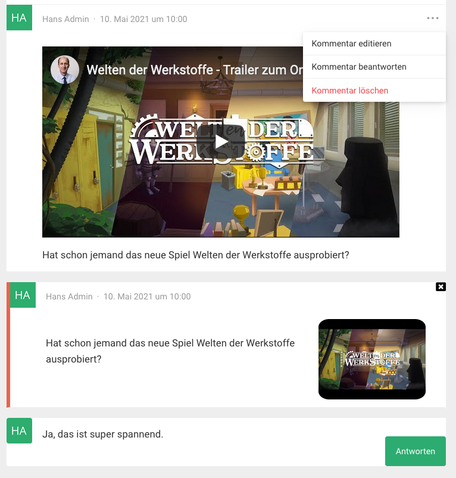

# spaces-comments
Improve the post comments by adding replyTo and other useful features. Works best with the ckeditor and supports only the defaultspaces and child themes. 

# Technical Details
The Plug-In is using vue.js and the WordPress Rest-API for creating, updating, deleting and showing comments.
It is supporting only the defaultspace or any child theme. 
This plug-in works best in connection with the spaces-editor plug-in.
# Installation
Activate the plug-In in the network admin settings screen in WordPress.
